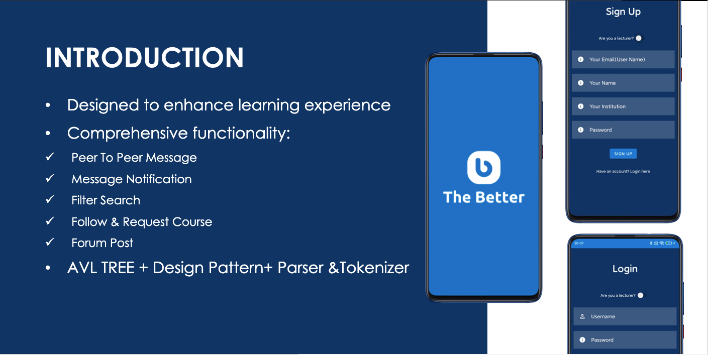
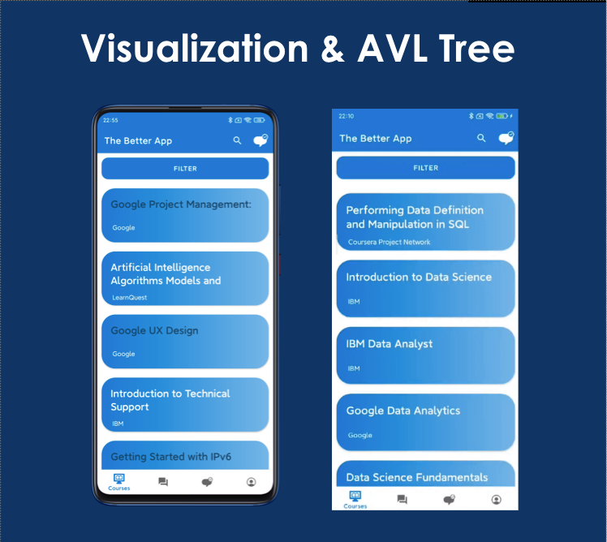
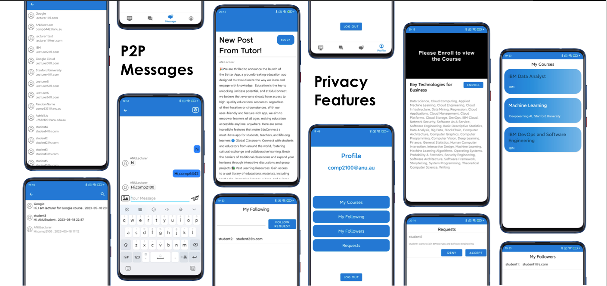

Educational platform Android App i
Important parts that I did:
- Implementing peer-to-peer messaging using Firebase real time database to store the message info
- Storing user recent video in an AVL tree for future usage
- visualising data from firebase in recyclerview
- praciticing software design, design pattern, refactoring and collaborating skills
Here are some images of the application ( I was thinking of deploying it to PlayStore but it costs $15 and also takes a few day so nahh):

